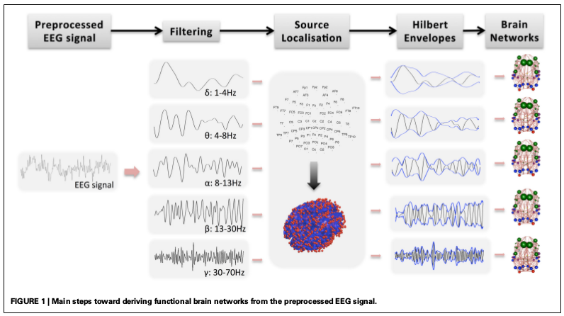
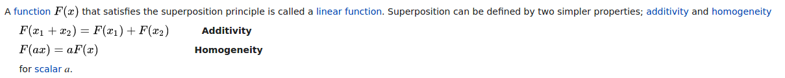

# Source localization is a crucial step in brain network analysis

Source: https://doi.org/10.1016/j.pnpbp.2014.01.008

---
# Mathematical formulation
<col2>

- For single dipole source:
$$
  m(r) = g(r, r_{dip}, d)
$$
- For multiple dipole sources:

$$
  m(r) = \sum(g(r, r_{dip_i}, d_i))
$$

$m(r)$: electric potential measure on the scalp
$r$: vector describing position of the measurement point
$r_{dip_i}$: position vector of the dipole
$d_i$: dipole moment vector

</col2>

---
$$

\begin{bmatrix}
m(r_1) \\
. \\
. \\
m(r_N)
\end{bmatrix}

$$

---

| Reference | Detail |
| --- | --- |
| [Superposition principle](https://en.wikipedia.org/wiki/Superposition_principle) | 
 The superposition principle,[1] also known as superposition property, states that, for all linear systems, the net response caused by two or more stimuli is the sum of the responses that would have been caused by each stimulus individually. So that if input A produces response X and input B produces response Y then input (A + B) produces response (X + Y). 
 |
| [Dipole](https://en.wikipedia.org/wiki/Dipole) | 
 In electromagnetism, there are two kinds of dipoles:   - An electric dipole deals with the separation of the positive and negative charges found in any electromagnetic system. A simple example of this system is a pair of electric charges of equal magnitude but opposite sign separated by some typically small distance. (A permanent electric dipole is called an electret.)   - A magnetic dipole is the closed circulation of an electric current system. A simple example is a single loop of wire with constant current through it. A bar magnet is an example of a magnet with a permanent magnetic dipole moment.[1][2]

---
# Superposition property

---

# Resource(s)
- [The Three Layer Concentric Sphere Head Model ](https://www.researchgate.net/figure/The-Three-Layer-Concentric-Sphere-Head-Model_fig1_272162190)
